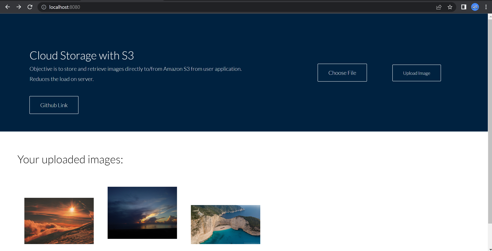

# Cloud Storage with Amazon Simple Storage Service (Amazon S3)

### Screenshot

## Introduction
Sometimes systems don’t have enough local storage and other resources to store huge amount of data. To solve this problem, one can avail such resources from cloud platforms i.e., AWS, Microsoft’s Azure. Instead of using costly external storage devices, remote servers or data centers in cloud computing can be utilized.  I undertake amazon S3 (Simple Storage Service) to solve this problem because it provides data storage with high security and stores data in form of objects over the cloud.

## Objectives

- Store images directly to Amazon S3 from user application
- Retrieve images from S3 bucket from anywhere on the web 
- Reduce the load on server

## Built With

- HTML5, CSS3
- JavaScript
- Express.js
- AWS SDK for JavaScript

## Methodology

First step is to create simple frontend application for users. Afterwards, setup basic server to create new endpoint that will allow clients to get secure URL. 
Then create the S3 bucket and upload images directly to s3 bucket and then to retrieve them later rather than having to go through server to upload/download images. 
It will reduce the load on server because server doesn’t have to process the image’s data and forward to and from s3 bucket. Server will not handle actual image data hence significantly decrease the amount of data transfer. 

## What I learned

- Setting up a basic server with express.js
- Getting familiar with Amazon Web Services
- How to create bucket and store data using Amazon S3

## Future work that can be done
One can setup CloudFront CDN (content delivery network) for S3. This enables us to distribute data of our application globally so that client have access to it from the location closes to them. 

